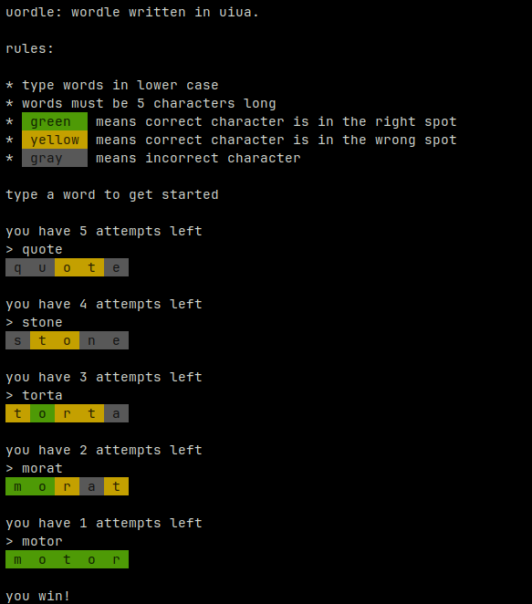

# uordle

A Wordle clone written in [Uiua](https://github.com/uiua-lang/uiua).

## Running

First, make sure you have [installed Uiua](https://github.com/uiua-lang/uiua#installation).

Then, run `uiua run uordle.ua` and have fun!
